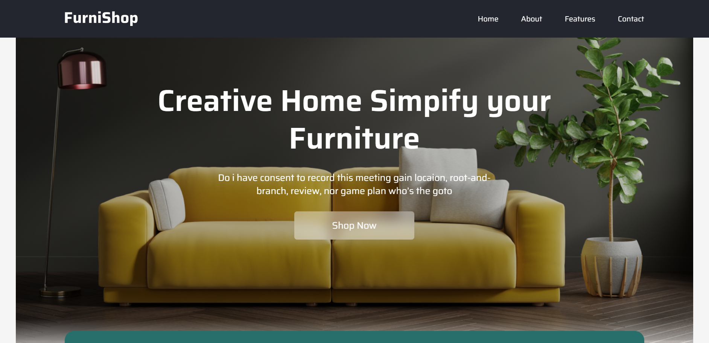
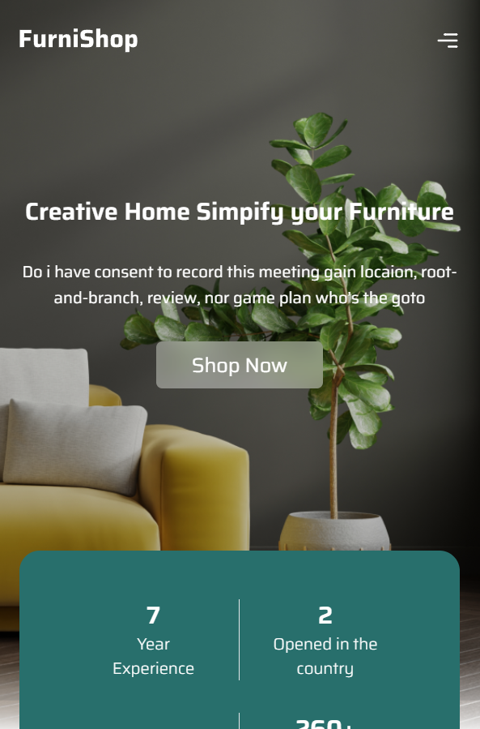
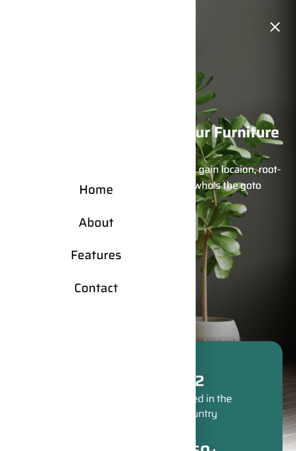

# FurniShop

## Overview

This project is a furniture shop product listing page developed using React and Tailwind CSS. The main goal of the project is to create a landing page with a visually appealing user interface (UI) and user experience (UX).

## Features

- **Responsive Design**: The layout adjusts to different screen sizes, providing an optimal viewing experience on mobile, tablet, and desktop devices.
- **Product Listing**: Displays a list of furniture products with images, names, descriptions, and prices.
- **Navigation**: Includes a navbar for easy navigation through different sections of the page.
- **Interactive UI**: Enhanced user interactions with smooth transitions and animations.
- **Tailwind CSS**: Utilized Tailwind CSS for efficient and customizable styling.

## Screenshots

            

  
  

## Technologies Used

- **React**: A JavaScript library for building user interfaces.
- **Tailwind CSS**: A utility-first CSS framework for rapid UI development.
- **JavaScript**: The programming language used for developing interactive elements.
- **HTML5**: The standard markup language for creating web pages.
- **CSS3**: Used in conjunction with Tailwind CSS for styling.

